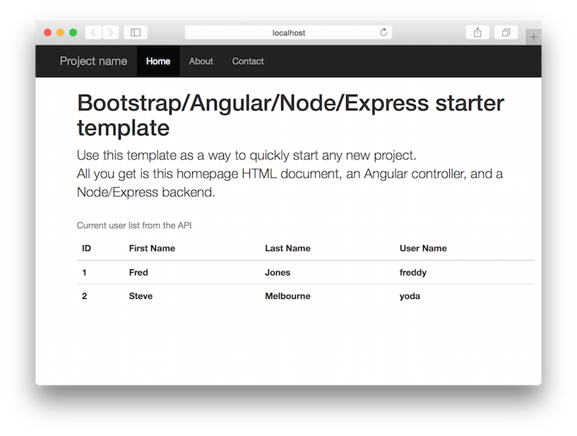

## Admin App Template

Shell of a Bootstrap-based admin page.



It uses:

* [Node.js](https://nodejs.org)
* [Express](http://expressjs.com/)
* [Twitter Bootstrap](http://getbootstrap.com/)
* [Google Angular](https://angularjs.org/)
* [UI Bootstrap](http://angular-ui.github.io/bootstrap/)

### Dev Environment Setup

1. Install node.js from the [main site](https://nodejs.org).  Make sure it works:
  ```
$ node -v
```
2. Clone this repo into a new directory
  ```
$ git clone https://github.com/jbaumbach/admin-app.git myapp
```
3. Go to the directory and install dependencies
  ```
$ cd myapp && npm install
```
4. Start the node webserver
  ```
$ npm start
```
5. Open your favorite browser and check out your site:
> <http://localhost:3000>
